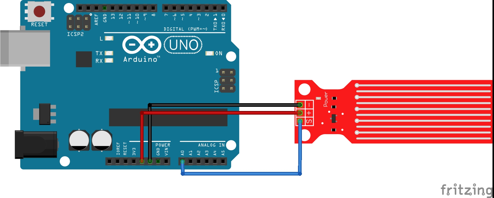
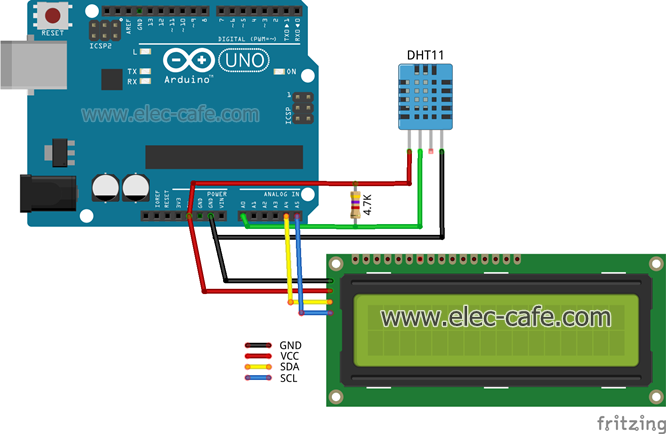

# Дизајнирање

## Технички ресурси

1. Arduino uno 
2. Water sensor - за детекција на вода и мерење на нивото на водата
3. Buzzer - за симулација на аларм
4. Breadboard - за поставување на елементите
5. Jumper wires - за спојување
6. DHT11 sensor - за мерење на влажност и температура на воздухот
7. LCD екран - за приказ на податоците
8. Arduino IDE
9. код кој што ќе се извршува, напишан во Arduino IDE

## Proof of concept

Mоделот кој ќе ја прикажува мојата идеја ќе биде составен од
комбинација на следните два модели:

1. Модел за поврзување на сензорот за вода
   

 [7]

2. Модел за поврзување на DHT11 сензорот за влажност и температура на
   воздухот
   

 [8]

## Development team

За оваа идеја да стане реалност ќе се погрижам јас со помош на сопствените знаења како и истражувања и видеа од слични проекти пронајдени на Интернет. Во однос на хардверските компоненти, купени се готови изработени од хардверски инженери и користен е софтвер изработен соодветно од ВС софтверски инженери.