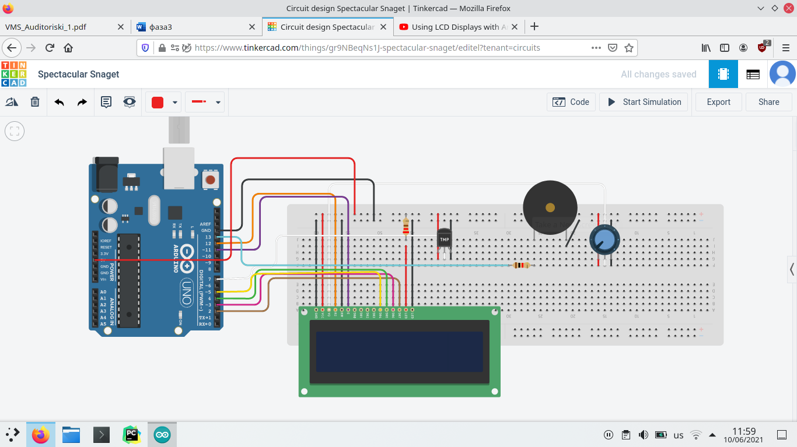
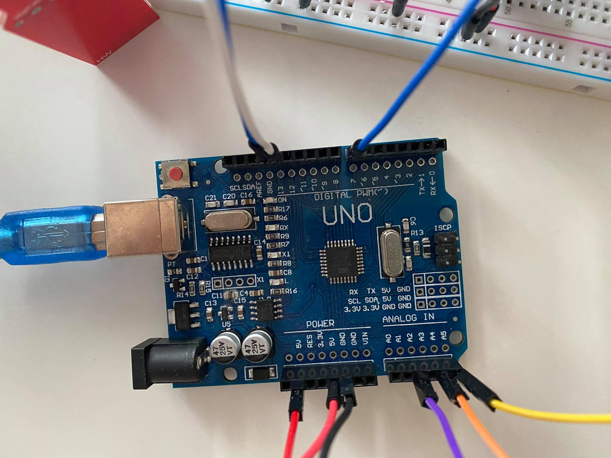
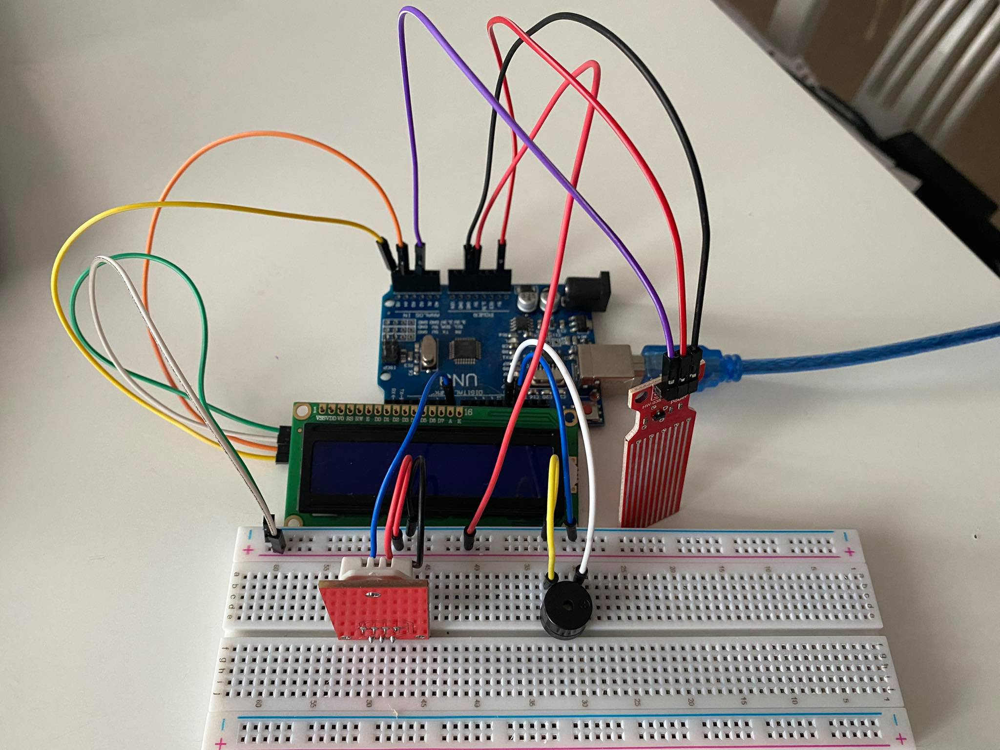
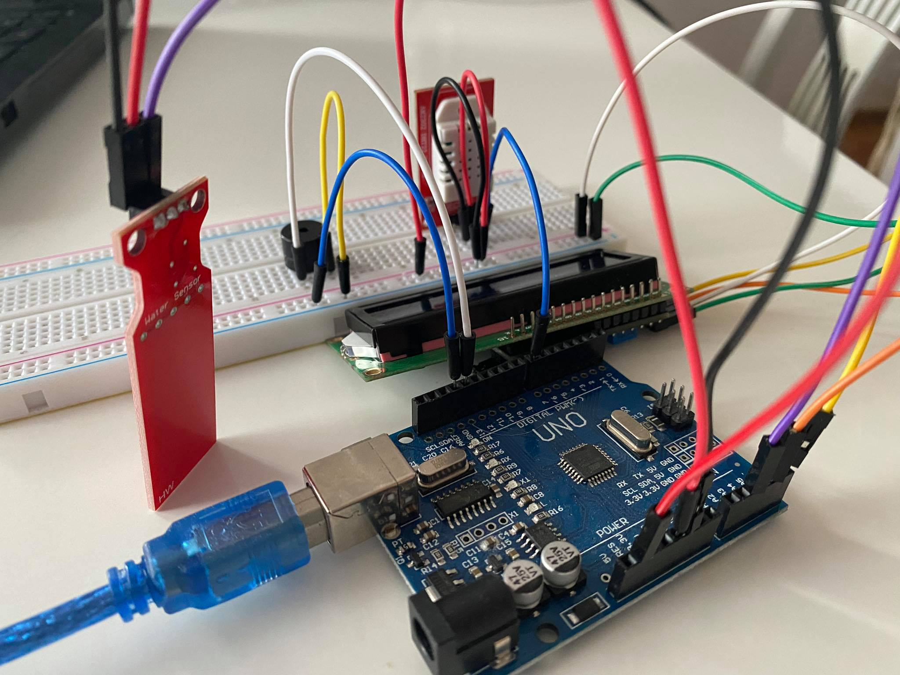
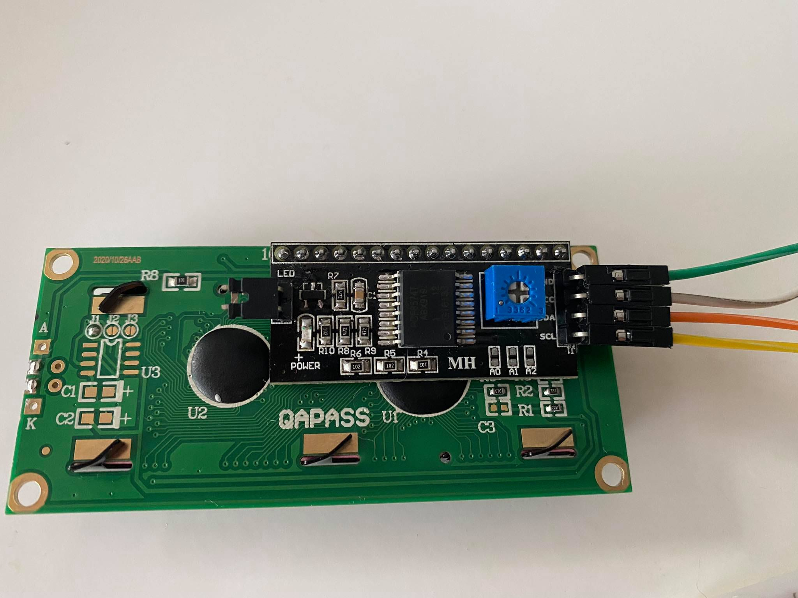

# Имплементација

## Алфа прототип

Алфа прототипот претставува груба верзија на продуктот која ги открива функционалните проблеми и ни помага да согледаме што треба да смениме и поправиме пред истиот да биде пуштен во продукција.

Мојот продукт ги има следните проблеми во овој момент:

1. LCD екранот работи (свети), меѓутоа не се прикажува никаков текст на него
2. Piezo звучникот свири постојано

Шематски приказ на продуктот:

 [9]

На оваа слика недостасува water sensor-от, кој за жал го немаше во TinkerCad.

## Бета прототип

Верзија на продуктот која е готова за продукција. Овој прототип се тестира од мала група корисници кои даваат повратни информации.

Решение на проблемите од Алфа прототип:

1. Проблемот со LCD екранот го решив така што стандардниот setup за LCD го заменив со I2C, односно пинот GND го поврзав со ground (-) на breadboard-от, пинот VCC го поврзав со power (+) на breadboard-от, пинот SDA го поврзав со аналогниот пин A4 на Arduino и пинот SCL го поврзав со аналогниот пин А5 на Arduino. Откако го направив сето ова, на задниот дел од I2C има плав потенциометар со чија помош го наместив контрастот за убаво да се прикажат посакуваните резултати
2.  Проблемот со Piezo звучникот го решив така што го тргнав 220 Ohm-ниот резистор и потенциометарот и го оставив поврзан од power (+) на breadboard-от во неговиот позитивен пин, како и ground (-) од breadboard-от во другиот пин на Piezo и звукот што го испушта е навистина силен и непријатен што беше и целта

Шема на продуктот:

1. LDC екран поврзан со I2C
2. I2C пинови:
   
   - GND поврзан со (-) пин на breadboard
   
   - VCC поврзан со (+) пин на breadboard
   
   - SDA поврзан со аналоген пин A4 на Arduino
   
   - SCL поврзан со аналоген пин A5 на Arduino
3. DHT22 сензор за влажност и температура, пинови:
   
   - DAT поврзан со дигитален пин 7 на Arduino
   
   - VCC поврзан со (+) пин на breadboard
   
   - GND поврзан со (-) пин на breadboard
4. Water sensor пинови:
   
   - (+) поврзан со 5V пин на Arduino
   
   - (-) поврзан со GND пин на Arduino
   
   - S поврзан со аналоген пин 2 на Arduino
5. Piezo пинови:
   
   - (+) поврзан со дигитален пин 13 на Arduino
   
   - (-) поврзан со (-) пин на breadboard
6. Arduino останати пинови:
   
   - 5V поврзан со (+) на breadboard
   
   - GND поврзан со (-) на breadboard

Слики:

