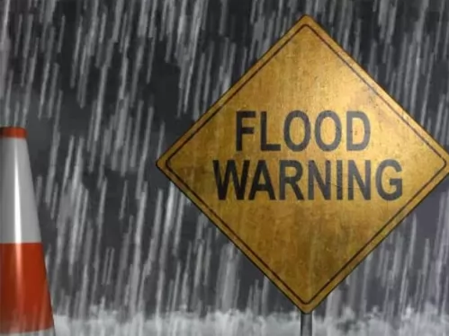

# Планирање и анализа

## Потреба

Луѓето секојдневно можат да се најдат во опасни ситуации, особено лицата кои комплетно или делумно го имаат изгубено својот вид, и за жал често не можат навремено да ги избегнат токму заради нивната попреченост. Една од тие опасности е и поплава. Како последица на нивната попреченост, овие лица имаат изострени сетила за слух. Токму тоа сакам да го искористам да им помогнам да добијат предупредување за евакуација во случај на поплава. Исто така уредот може да се модифицира да им помага да извршуваат секојдневни активности како готвење, правење чај, кафе и слично. За сите останати кои можеби сакаат да ја знаат моменталната температура и влажност на воздухот овој уред нуди и такви информации прикажани на LCD екран како дополнителна карактеристика.

 [3]

## Целна група

Овој продукт е наменет за сите лица (особено е корисен за лица со попреченост во видот) од било која возраст, пол или професија. Овој систем може да се користи  во домот, на работното место, во јавен превоз и јавни установи. Придобивките од овој систем би биле добивање информации кои им се од интерес на сите луѓе како и навремена евакуација од поплава и избегнување посериозни повреди па дури и смрт.

 [4]

## Побарувања

1. Aлармот треба да е доволно гласен да може да го слушнат сите (дури и оние кои што можеби слушаат музика на слушалки, разговараат на телефон или пак имаат некакво поблаго нарушување на слухот)

2. Алармот треба да е доволно непријатен за да се обрне внимание на него

3. Буквите на LCD екранот да се доволно големи за да може секој да ги види

4. Мерењата да се извршуваат доволно често за температурата и влажноста да се секогаш прецизни

5. Често да се проверува присуство/ниво на вода

 [5]

## Конкуренција

Моментална конкуренција на пазарот се алармите за поплава, меѓутоа она по кое се разликувам од нив се дополнителните информации за температурата и влажноста на воздухот. Уште една предност е тоа што може да се пренамени како уред кој може да им ги олесни секојдневните обврски на луѓето со попреченост во видот. Пр: доколку сакаат да си послужат шолја чај, го ставаат уредот на врвот и истураат вода се додека не го слушнат алармот (на овој начин нема да си истурат врела вода надвор од шолјата за чај). Истото важи и за готвење во лонец, здела итн. Ова е навистина повеќе од се она што е досега понудено од било кој друг производител.

 [6]